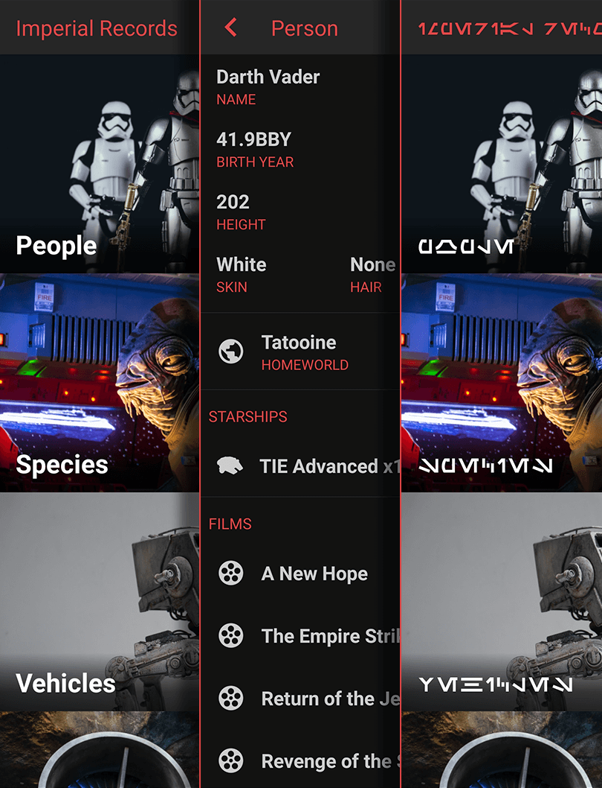

<h1 align="center">Imperial Records</h1> 

  

  Learn all you never knew about Star Wars!

  
  

  <!--  -->

  <!--  -->

<!-- [BEGIN] Don't edit this section, instead run Markdown AIO: Update Table of Contents -->
## 🚩 Table of Contents

- [🚩 Table of Contents](#-table-of-contents)
- [🚀 Introduction](#-introduction)
- [🎨 Features](#-features)
- [💬 Contributing](#-contributing)
- [❤️ Acknowledgments](#️-acknowledgments)
<!-- [END] Don't edit this section, instead run Markdown AIO: Update Table of Contents -->

## 🚀 Introduction

This app puts all the knowledge of the stars in you hands. Learn about the characters, starships, and more!

  

## 🎨 Features

* We have data about People, Vehicles, Starships, Planets and more!
* As you browse the data is stored for offline use.
* Comes with support for you favorite language: Aurebesh.

## 💬 Contributing

Would like to help make this app better? Please take a look at the [contributing guidelines](./CONTRIBUTING.md) for a detailed explanation on how you can contribute.

## ❤️ Acknowledgments

* Tycho Ordo for the [Aurebesh font](https://boards.theforce.net/threads/updated-new-aurebesh-font.50009464/)
* Data by [SWAPI](https://swapi.dev)
* Images by [Unsplash](https://unsplash.com)
